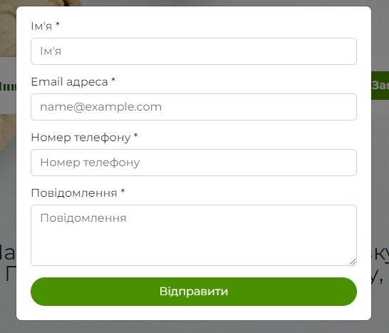

# Eco Group Invest (real order)

[Here you can check it](https://artemuholkov.github.io/eco_group_invest/)

---

I didn't have figma design for this project.
This landing page is 100% responsive for all types of screens.
I used HTML, CSS, JS in this project.

---

###What was interesting in this project:

1. Interesting view of main section combined with image and important information.


2. 3\4 screen mobile menu with fading background.


3. Modal popup form which sends message to e-mail of page owner. I used special service for this.



```
 <form action="https://postmail.invotes.com/send" method="post" id="email_form">
```

4. About us section. Text wrapping around middle tree image.


5. Simple footer


---
